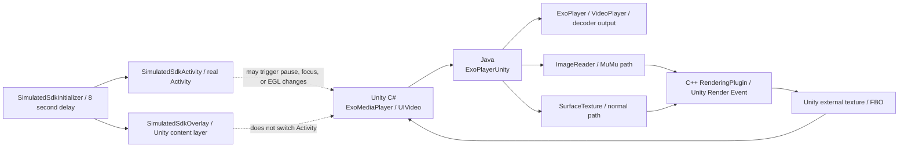

# Unity Android 视频组件与 SDK 初始化问题处理总结

## 1. 文档目的

本文记录 Unity Android 视频组件在 MuMu Android 15 及以上版本、接入 SDK 初始化流程后出现黑屏和黑帧闪烁问题的定位过程、技术原因、代码调整和验证方法。

本文只覆盖以下核心代码范围：

- `VideoPlugin/Assets/Video`：Unity C# 视频组件层
- `VideoPlugin/Assets/SimulatedSdk`：模拟 SDK 初始化流程
- `VideoPlugin/Assets/Plugins/Android`：模拟 SDK Java 层和 Android Manifest
- `VideoPlayerPlugin/app/src/main/java`：视频 Java 层
- `VideoPlayerPlugin/app/src/main/cpp`：视频 C++ 渲染插件层
- 根目录 `log.txt`：问题日志

## 2. 问题现象

### 未接入 SDK

- MuMu Android 15 模拟器中视频可以正常显示。
- Unity 退到后台再回到前台后，视频仍可以正常显示。

### 接入 SDK 初始化流程后

- 游戏启动时视频正常。
- SDK 初始化、登录或 Activity 切换后，MuMu 模拟器中的视频可能变黑。
- Android 真机上基本正常，问题主要出现在 MuMu 模拟器。
- 使用 Activity 模式模拟登录时，登录完成返回 Unity 后曾出现一次短暂黑帧，随后视频恢复正常。

这说明问题不是单纯的解码失败，而是 MuMu 的 Activity/EGL 生命周期、视频输出 Surface 和 Unity 外部纹理之间的时序差异。

## 3. 视频渲染链路



核心流程是：

1. Unity C# 创建和控制 `ExoPlayerUnity`。
2. Java 使用 ExoPlayer 解码，并将视频输出到 `ImageReader` 或 `SurfaceTexture`。
3. C++ `RenderingPlugin` 通过 Unity Render Event 在 Unity 渲染线程中处理 GL 资源。
4. Unity C# 将 Java 层生成的纹理包装为 Unity 外部纹理并显示。

因此，Activity 生命周期变化会同时影响：

- Unity 的 `OnApplicationPause`。
- EGL/GL context 是否被重建。
- Java 视频输出 Surface 是否仍然有效。
- Unity 外部纹理和 FBO 是否仍然有效。

## 4. MuMu Android 15+ 的 RGB565 约束

MuMu Android 15 及以上版本不能简单按真机路径使用 `YUV_420_888`。当前代码保留以下逻辑：

1. 识别 MuMu 模拟器，例如检测 `/system/etc/mumu-configs`。
2. MuMu 使用 `ImageReader` 模式。
3. Android 15 及以上优先使用 `PixelFormat.RGB_565`。
4. 如果实际解码器输出格式和当前 `ImageReader` 不匹配，再按候选格式回退：

```text
RGB_565 -> YUV_420_888 -> RGBA_8888
```

日志中可能出现类似：

```text
Producer output buffer format ... does not match ImageReader configured format ...
RecreateImageReaderWithFormat: switched to format ...
```

这表示格式回退流程正在工作，不应为了消除日志而直接取消 MuMu Android 15+ 的 RGB565 逻辑。该逻辑是避免 MuMu 视频格式转换崩溃的重要兼容处理。

## 5. 模拟 SDK 流程

### 5.1 延迟入口

`SimulatedSdkInitializer` 在 Android 真机包中等待：

```text
Login Page Delay = 8 秒
```

延迟位于 `SimulatedSdkInitializer` 层，而不是 Activity 内部。这样可以模拟真实 SDK 初始化完成一段时间后才弹出登录界面的流程。

### 5.2 Activity 模式

`SimulatedSdkActivity`：

- 是真实 Android Activity。
- 通过 Manifest 注册。
- 使用非全屏、居中的 Dialog 风格窗口。
- 模拟初始化、协议页、登录页和登录完成回调。
- 通过 `UnityPlayer.UnitySendMessage` 回调 Unity。
- 用于测试真实 Activity 切换对 Unity pause/focus、EGL 和视频组件的影响。

### 5.3 Overlay 模式

`SimulatedSdkOverlay`：

- 不启动第二个 Activity。
- 直接添加到 Unity Activity 的 `android.R.id.content` 内容层。
- 登录卡片覆盖在 Unity 画面上方。
- Unity Activity、EGL 和 Unity 渲染循环保持不变。
- 用于验证“仅有 SDK UI 覆盖，但没有 Activity 生命周期切换”时视频是否正常。

### 5.4 开关配置

在 Unity Inspector 的 `SimulatedSdkInitializer` 上配置：

```text
Use Android Activity       = true
Use Non Blocking Overlay   = false / true
Login Page Delay           = 8
```

对照测试：

- `Use Non Blocking Overlay = false`：Activity 生命周期测试。
- `Use Non Blocking Overlay = true`：不切换 Activity 的 Overlay 测试。

如果 Overlay 正常而 Activity 模式异常，可以基本确认问题位于 Activity 生命周期、EGL 或 Surface 恢复链路，而不是 SDK 登录 UI 本身。

## 6. 黑屏问题的核心原因

### 6.1 SDK Activity 造成生命周期差异

真机和 MuMu 对 Activity 切换、窗口焦点和 EGL context 的处理不完全一致。MuMu 可能在 SDK Activity 出现或退出时触发与真机不同的 EGL/Surface 生命周期。

### 6.2 旧的恢复流程过于激进

Unity 回到前台时，`ExoMediaPlayer.OnApplicationPause(false)` 会设置恢复标记，并在下一次 Render 中发送 `Resume` 事件。

旧流程中，Java `ExoPlayerUnity.Resume()` 无条件执行：

```text
DestroySurface()
DestroyGl()
CreateExoSurface()
重新绑定视频输出 Surface
```

即使 EGL context 实际没有丢失，也会主动销毁现有视频输出和纹理。此时新 Surface 尚未产生首帧，Unity 就可能显示一帧黑画面。

### 6.3 C# 侧曾无条件清空纹理缓存

旧的 C# 恢复逻辑会将纹理句柄和纹理 revision 强制清空，进一步促使 Unity 重新创建外部纹理，从而扩大黑帧窗口。

## 7. 最终修复方案

### 7.1 只在真实 EGL 重建时重建视频资源

`ExoPlayerUnity` 增加了：

```java
m_NeedsSurfaceRecreationAfterContextReset
```

只有以下事件会设置该标记：

- `OnGraphicsDeviceInitialize()`。
- `OnGraphicsDeviceShutdown()`。

恢复时分两条路径：

```text
普通 Activity 返回
    -> 保留 ImageReader / SurfaceTexture / GL 资源
    -> 只恢复 ExoPlayer 播放
    -> 保留 Unity 当前纹理

真实 EGL context 重建
    -> 销毁旧资源
    -> 创建新的视频输出 Surface
    -> 重建 GL/FBO/外部纹理
    -> 重新绑定播放器
```

### 7.2 C# 不再无条件清空纹理

`ExoMediaPlayer.Render()` 在恢复时不再直接设置：

```csharp
m_TextureHandle = 0;
m_TextureRevision = -1;
```

纹理 revision 由 Java 层在真实 EGL context 重建时递增。这样：

- 没有 EGL 重建：继续使用当前 Unity 纹理，避免黑帧。
- 有 EGL 重建：revision 变化，Unity 自动销毁并重新包装外部纹理。

### 7.3 Activity 退出动画关闭

模拟 Activity 登录完成和返回时调用：

```java
overridePendingTransition(0, 0);
```

用于减少 Activity 窗口动画造成的视觉闪烁。

## 8. 关键代码文件

| 文件 | 作用 |
|---|---|
| `VideoPlugin/Assets/Video/VideoController/MediaPlayer/ExoMediaPlayer.cs` | Unity C# 播放控制、pause/resume、Render Event 调度 |
| `VideoPlayerPlugin/app/src/main/java/com/unity3d/exovideo/ExoPlayerUnity.java` | Java 播放器、ImageReader、SurfaceTexture、GL 资源恢复 |
| `VideoPlayerPlugin/app/src/main/cpp/RenderingPlugin.cpp` | Unity Render Event、C++/JNI、SurfaceTexture 和渲染线程桥接 |
| `VideoPlayerPlugin/app/src/main/java/com/unity3d/Texture2DExtYUV.java` | YUV/RGB 图像处理和纹理转换相关逻辑 |
| `VideoPlugin/Assets/SimulatedSdk/SimulatedSdkInitializer.cs` | 8 秒延迟、Activity/Overlay 模式切换和模拟 SDK 状态机 |
| `VideoPlugin/Assets/Plugins/Android/com/unity3d/simulatedsdk/SimulatedSdkActivity.java` | 真实 Activity 模式的模拟登录界面 |
| `VideoPlugin/Assets/Plugins/Android/com/unity3d/simulatedsdk/SimulatedSdkOverlay.java` | 不切换 Activity 的 Overlay 模式 |
| `VideoPlugin/Assets/Plugins/Android/AndroidManifest.xml` | Unity Activity 和模拟 SDK Activity 注册 |
| `VideoPlugin/ProjectSettings/ProjectSettings.asset` | Unity Android 安装位置等构建配置 |

## 9. 验证方法

### 9.1 Activity 模式

1. 设置 `Use Non Blocking Overlay = false`。
2. 设置 `Login Page Delay = 8`。
3. 启动视频。
4. 等待模拟登录页面出现并完成登录。
5. 观察返回 Unity 后视频是否保持连续显示。
6. 检查是否出现以下日志：

```text
Resume preserved existing surface and GL resources
```

如果看到该日志，说明本次返回没有发生 EGL context 重建，视频应该直接复用原画面。

### 9.2 EGL 重建路径

如果日志出现：

```text
Resume recreating surface after EGL context reset
```

说明系统确实发生了 EGL context 重建，代码会执行完整资源恢复。这条路径重点观察：

- 是否能恢复画面。
- 是否出现持续黑屏。
- 是否出现 `GL_INVALID_OPERATION`。
- 是否能继续播放新帧。

### 9.3 Overlay 模式

1. 设置 `Use Non Blocking Overlay = true`。
2. 启动视频并等待 8 秒。
3. 在 Overlay 登录页面显示期间观察 Unity 视频。
4. 点击模拟登录并观察 Overlay 移除后的画面。

Overlay 模式主要用于验证视频本身是否稳定，不用于模拟真实 Activity 生命周期。

## 10. 日志关键词

建议重点关注以下日志：

```text
Detected MuMu Emulator
Detected Emulator, Force Enable ImageReader mode
CreateExoSurface with ImageReader
Producer output buffer format ... does not match ...
RecreateImageReaderWithFormat
OnGraphicsDeviceInitialize
OnGraphicsDeviceShutdown
Resume preserved existing surface and GL resources
Resume recreating surface after EGL context reset
ReCreateTexture
glBindTexture error
```

判断原则：

- 格式 mismatch 后能够成功回退并继续播放，不一定是故障。
- `Resume preserved...` 表示普通 Activity 返回路径。
- `Resume recreating...` 表示真实 EGL 重建路径。
- 持续出现 `glBindTexture error` 或 `ReCreateTexture` 循环，才需要继续检查 GL 资源生命周期。

## 11. APK 构建注意事项

- 修改 Java、C# 或 Manifest 后必须重新打包，不能使用旧 APK 判断结果。
- 当前 Unity Android 安装位置配置为内部安装：`AndroidPreferredInstallLocation: 2`。
- Manifest 中启动 Activity 必须保留 `android:exported="true"`。
- 模拟 SDK Activity 不作为启动入口，使用 `android:exported="false"`。
- 修改 Manifest 后应检查最终生成 APK 中的合并 Manifest，确认实际包内配置和工程源码一致。

## 12. 当前结论

当前问题可以分成两类：

1. MuMu Android 15+ 的视频格式兼容问题：保留 RGB565 优先逻辑，并允许格式回退。
2. SDK Activity 生命周期造成的视频资源恢复问题：普通返回不再无条件销毁和重建视频资源，只有真实 EGL context 重建时才执行完整恢复。

Overlay 模式提供了一个稳定的对照实验：如果 Overlay 模式始终正常，而 Activity 模式只在真实 EGL 重建路径出现问题，就可以继续把排查范围限定在 MuMu 的 Activity/EGL 生命周期，不需要改变 MuMu 的 RGB565 兼容方案。
